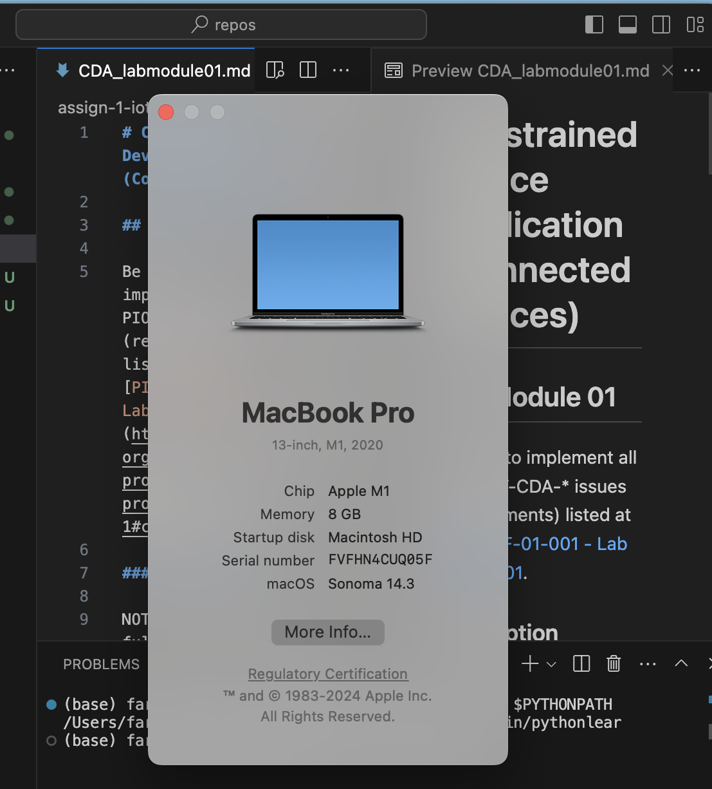
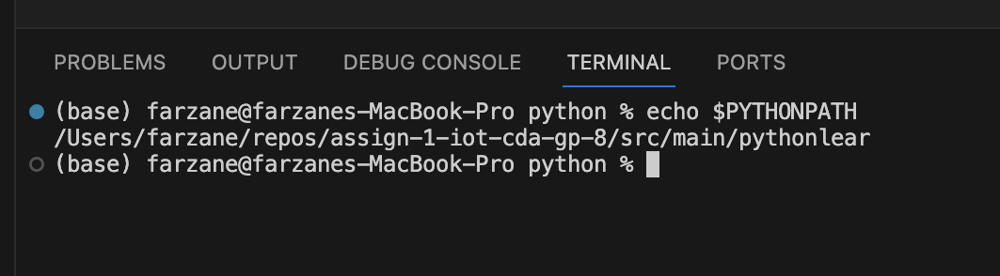
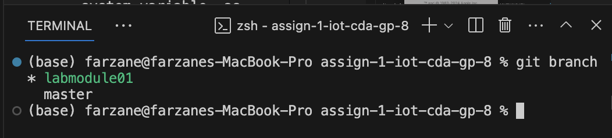
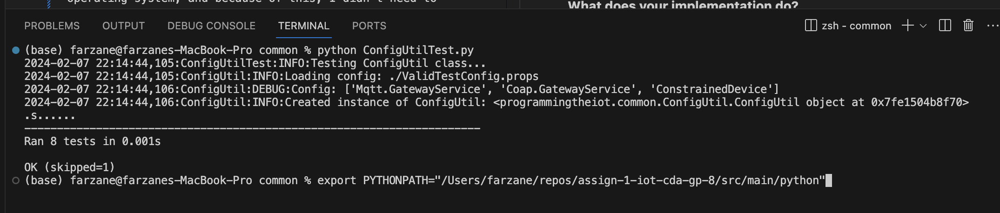
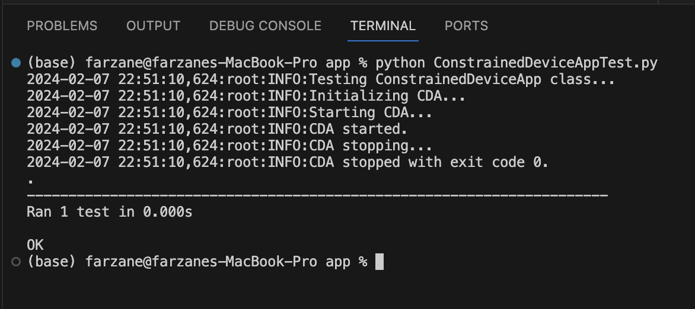

# Constrained Device Application (Connected Devices)

## Lab Module 01

Be sure to implement all the PIOT-CDA-* issues (requirements) listed at [PIOT-INF-01-001 - Lab Module 01](https://github.com/orgs/programming-the-iot/projects/1#column-9974937).

### Description

NOTE: Include two full paragraphs describing your implementation approach by answering the questions listed below.

**What does your implementation do?** \
I implemented my environment by using the native MacOS operating system, and because of this, I didn't need to install any additional libraries or packages. This can be seen in the following image \

I also ran the tests, and this was possible because I set the PYTHONPATH system variable, as seen in the below image \

Finally, I added the code into the new branch I made called `labmodule01` and pushed it there, which I then merged into the master branch. This branch can be seen in the below image \

**How does your implementation work?** \
The implementation works because macOS being a unix-based operating systems allows me to set PYTHONPATH easily in the command line which then lets me run the unit tests using the `unittest` module in Python. This can be seen in the below images \
 \

### Code Repository and Branch

NOTE: Be sure to include the branch (e.g. https://github.com/programming-the-iot/python-components/tree/alpha001).

URL: https://github.com/ENGR5520W24/assign-1-iot-cda-gp-8/tree/labmodule01

### UML Design Diagram(s)

NOTE: Include one or more UML designs representing your solution. It's expected each
diagram you provide will look similar to, but not the same as, its counterpart in the
book [Programming the IoT](https://learning.oreilly.com/library/view/programming-the-internet/9781492081401/).

### Unit Tests Executed

NOTE: TA's will execute your unit tests. You only need to list each test case below
(e.g. ConfigUtilTest, DataUtilTest, etc). Be sure to include all previous tests, too,
since you need to ensure you haven't introduced regressions.

- `python -m unittest ConfigUtilTest.py`
- 
- 

### Integration Tests Executed

NOTE: TA's will execute most of your integration tests using their own environment, with
some exceptions (such as your cloud connectivity tests). In such cases, they'll review
your code to ensure it's correct. As for the tests you execute, you only need to list each
test case below (e.g. SensorSimAdapterManagerTest, DeviceDataManagerTest, etc.)

- `python ConstrainedDeviceApp.py`
- 
- 

EOF.