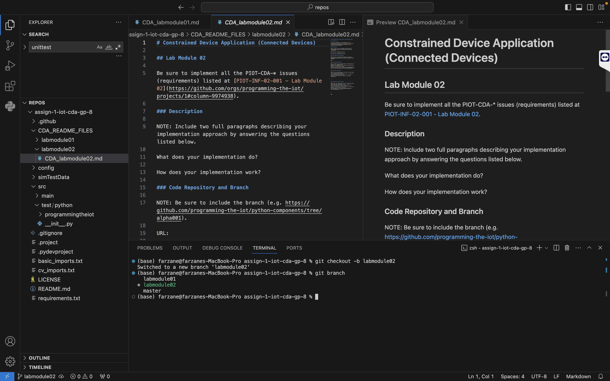
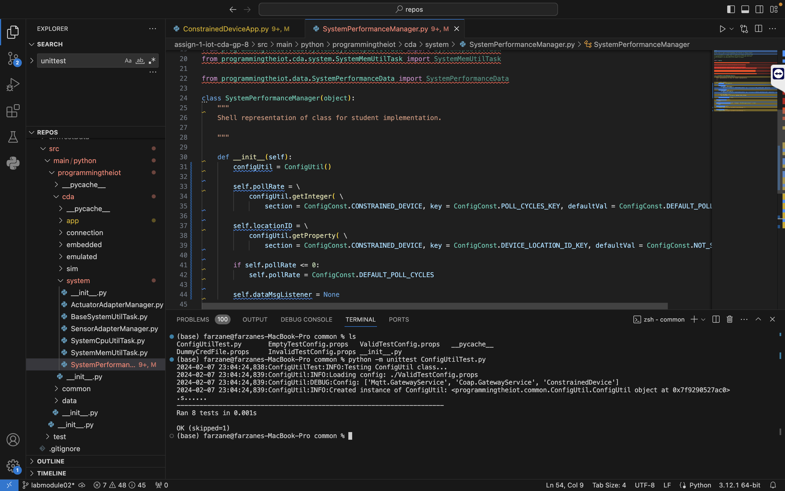
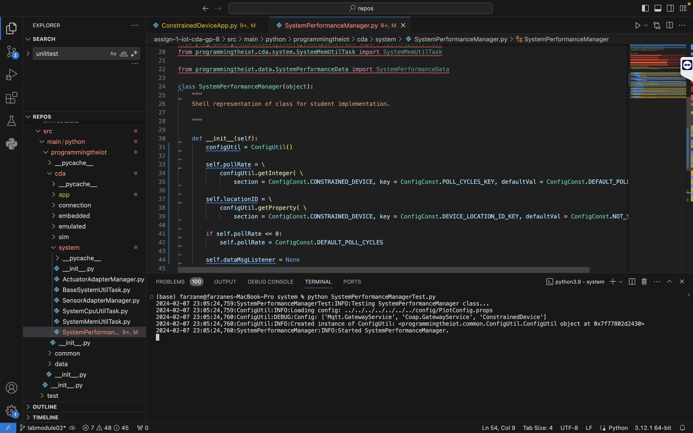
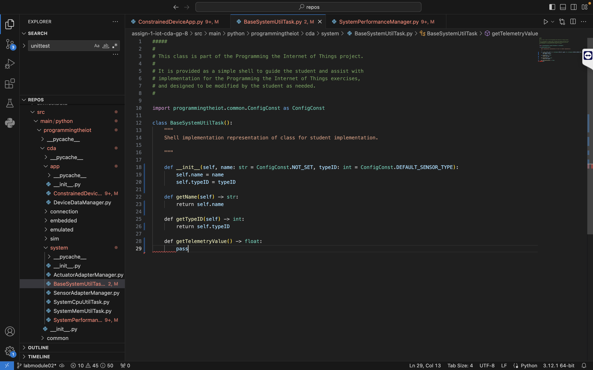
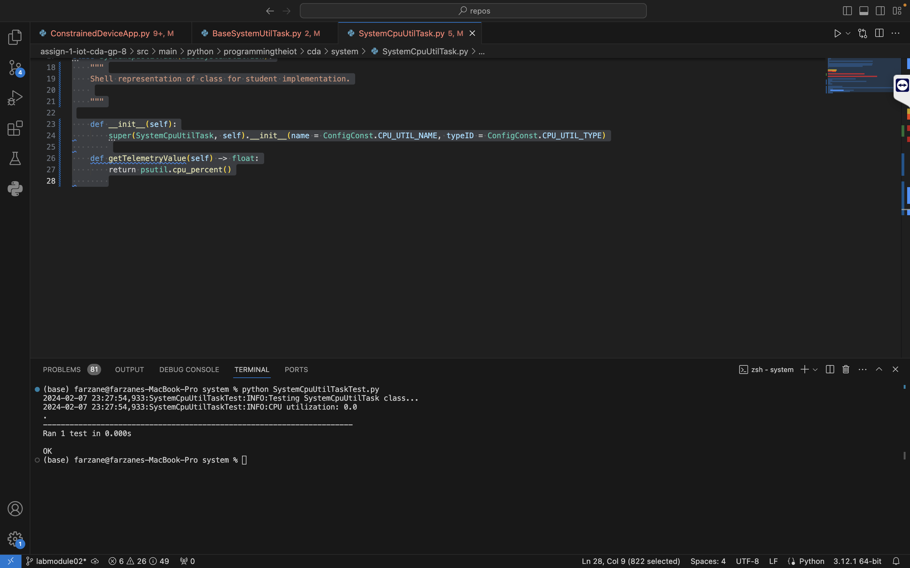
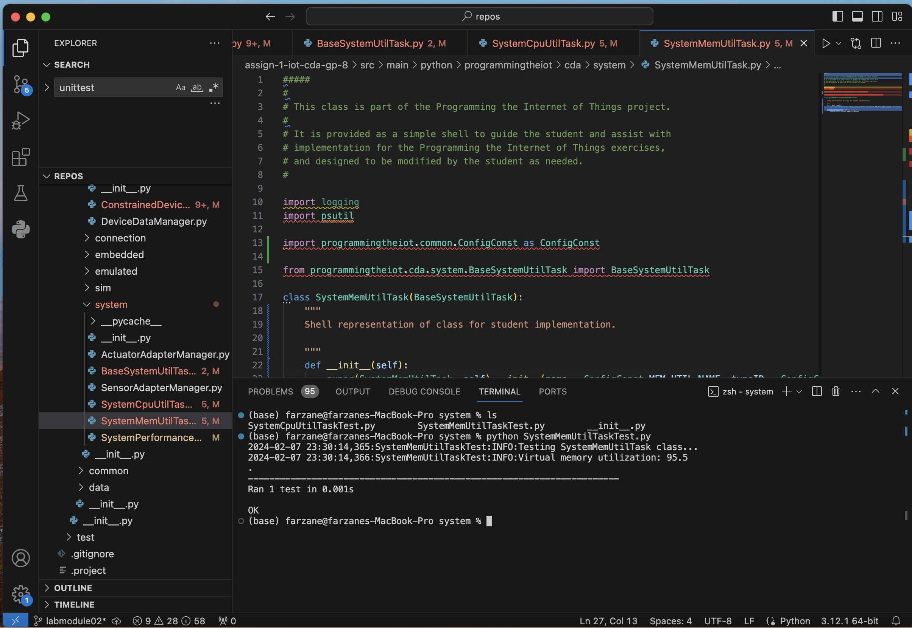
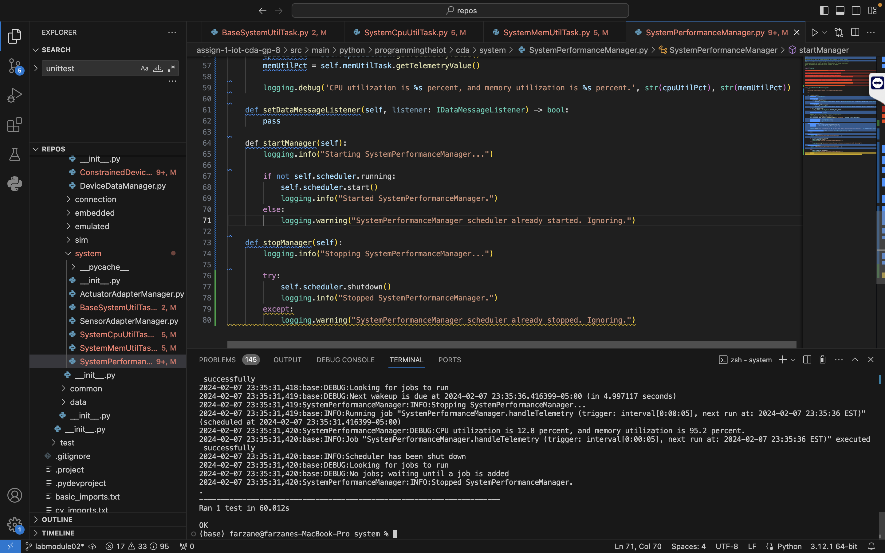
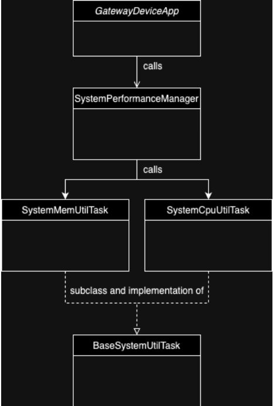

# Constrained Device Application (Connected Devices)

## Lab Module 01

Be sure to implement all the PIOT-CDA-* issues (requirements) listed at [PIOT-INF-01-001 - Lab Module 01](https://github.com/orgs/programming-the-iot/projects/1#column-9974937).

### Description

NOTE: Include two full paragraphs describing your implementation approach by answering the questions listed below.

**What does your implementation do?** \
This implementation uses different modules to output CPU and memory utilization periodically. The ran tests and other completed steps can be seen in the below images:

**How does your implementation work?** \
My implementation makes a lot of changes to the source code and implements different packages and modules within each other. These modules call upon each other and make different instance objects using the init methods in the class definitions, and I also make use of the logging package plus others. This can be seen in the above images.

### Code Repository and Branch

NOTE: Be sure to include the branch (e.g. https://github.com/programming-the-iot/python-components/tree/alpha001).

URL: https://github.com/ENGR5520W24/assign-1-iot-cda-gp-8/tree/labmodule02

### UML Design Diagram(s)

NOTE: Include one or more UML designs representing your solution. It's expected each
diagram you provide will look similar to, but not the same as, its counterpart in the
book [Programming the IoT](https://learning.oreilly.com/library/view/programming-the-internet/9781492081401/).

UML: 

### Unit Tests Executed

NOTE: TA's will execute your unit tests. You only need to list each test case below
(e.g. ConfigUtilTest, DataUtilTest, etc). Be sure to include all previous tests, too,
since you need to ensure you haven't introduced regressions.

- `python -m unittest ConfigUtilTest.py`
- `python -m unittest SystemCpuUtilTaskTest.py`
- `python -m unittest SystemMemUtilTaskTest.py`

### Integration Tests Executed

NOTE: TA's will execute most of your integration tests using their own environment, with
some exceptions (such as your cloud connectivity tests). In such cases, they'll review
your code to ensure it's correct. As for the tests you execute, you only need to list each
test case below (e.g. SensorSimAdapterManagerTest, DeviceDataManagerTest, etc.)

- `python ConstrainedDeviceApp.py`
- `python SystemPerformanceManagerTest.py`

EOF.